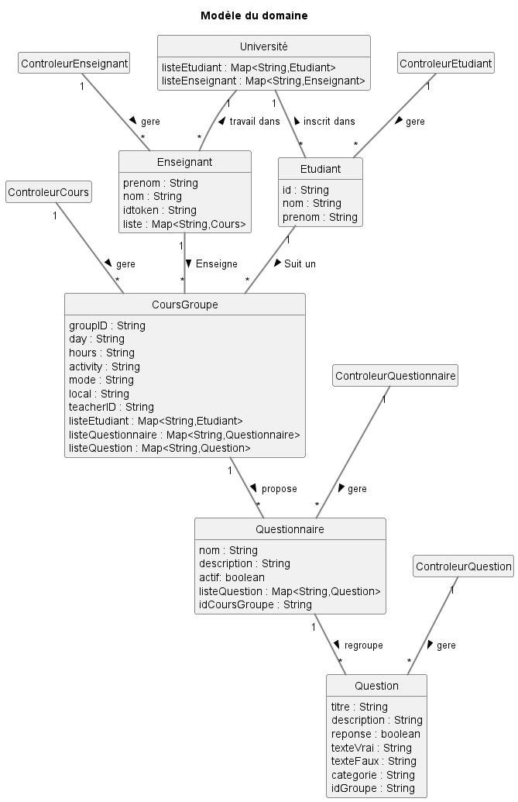
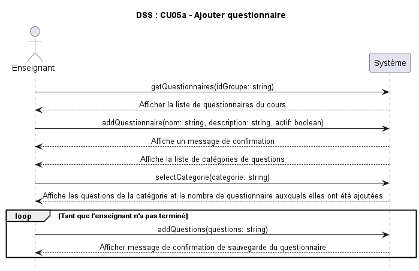
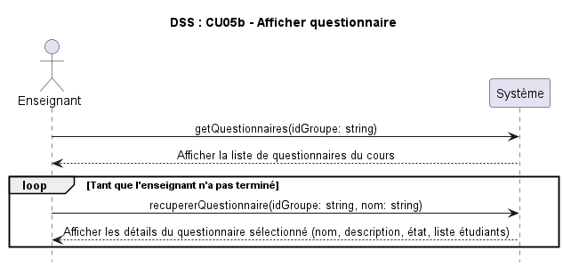
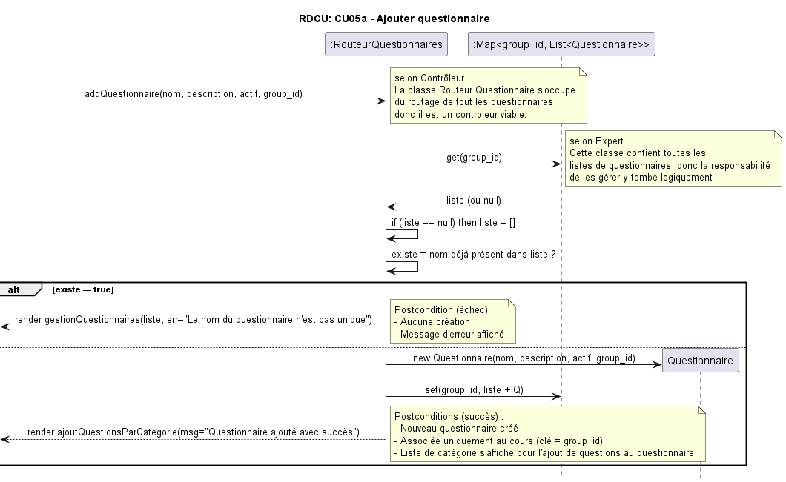
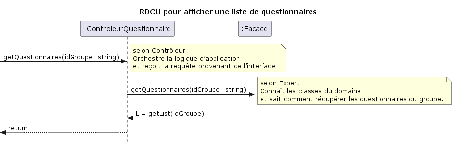
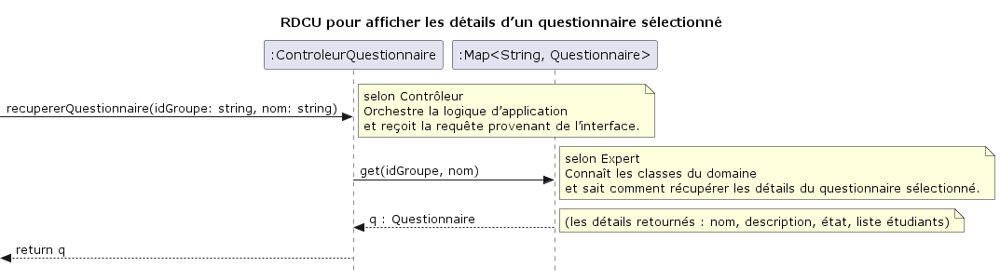

<!-- Changer le numéro de l'itération plus bas pour chaque rapport -->
# Rapport Itération numéro 2

## Identification des membres de l'équipe

Veuillez éditer ce fichier afin de fournir les informations nécessaires à votre évaluation.

Assurez-vous d'utiliser toujours le même compte GitHub pour accéder à ce projet.

## Membre 1

- <nomComplet1>Philippe Bolduc</nomComplet1>
- <courriel1>philippe.bolduc.3@ens.etsmtl.ca</courriel1>
- <codeMoodle1>AP85660</codeMoodle1>
- <githubAccount1>PhilippeBolduc-hub</githubAccount1>

## Membre 2

- <nomComplet2>Ishak Megatli</nomComplet2>
- <courriel2>ishak.megatli.1@ens.etsmtl.ca</courriel2>
- <codeMoodle2>AS96830</codeMoodle2>
- <githubAccount2>IshakMegatli1</githubAccount2>

## Membre 3

- <nomComplet3>Daniel Atik</nomComplet3>
- <courriel3>daniel.atik.1@ens.etsmtl.ca</courriel3>
- <codeMoodle3>AT56880</codeMoodle3>
- <githubAccount3>DanielAtik1</githubAccount3>

## Membre 4

- <nomComplet4>Marc-Sheldon Bazelais</nomComplet4>
- <courriel4>marc-sheldon.bazelais.1@ens.etsmtl.ca</courriel4>
- <codeMoodle4>AQ00910</codeMoodle4>
- <githubAccount4>msbazelais</githubAccount4>

## Exigences

> Liste des exigences et personnes responsables de celles-ci.

| Exigence                       | Responsable               |
| -----------------------------  | ------------------------  |
| CU05a conception               | Philippe / Marc-Sheldon   |
| CU05a analyse                  | Philippe / Marc-Sheldon   |
| CU05a révision de modeles      | Philippe Bolduc           |
| CU05a implémentation           | Marc-Sheldon              |
| CU05a tests                    | Marc-Sheldon              |
| CU05b conception               | Daniel / Philippe         |
| CU05b analyse                  | Daniel / Philippe         |
| CU05b révision de modeles      | Daniel / Philippe         |
| CU05b implémentation           | Ishak / Daniel            |
| CU05b tests                    | Ishak / Daniel            |

## Modèle du domaine (MDD)

> Le MDD est cumulatif : vous devez y ajouter des éléments à chaque itération (ou corriger les erreurs), selon la portée (et votre meilleure compréhension du problème) visée par votre solution. Utilisez une légende dans le MDD pour indiquer la couleur de chaque itération afin de faire ressortir les changements (ce n'est pas toujours possible pour les associations et les attributs). Voir les stéréotypes personnalisés : <https://plantuml.com/fr/class-diagram> et [comment faire une légende avec couleurs en PlantUML](https://stackoverflow.com/questions/30999290/how-to-generate-a-legend-with-colors-in-plantuml).

## Diagramme de séquence système (DSS)

> Un seul DSS sera choisi et corrigé par l'auxiliaire d'enseignement

## Contrats

> Si vous avez choisi un cas d'utilisation nécessitant un contrat, il faut le mettre dans cette section.
> Note: même s'il y a plusieurs contrats, un seul contrat sera choisi et corrigé par l'auxiliaire d'enseignement
> Note: il n'est pas nécessaire de mettre les préconditions mais je vous suggère fortement de les ajouter dans votre rapport. 

CU05a1
Opération : addQuestionnaire()

Post Conditions :

-Un nouveau questionnaire a été crée
-Le questionnaire courant a été associé au cours courant
________________________________________________________________________

CU05a2 / CU05b1
Opération : getQuestionnaire()

Post Conditions :

-La liste de questionnaires du groupe courant a été affichés
________________________________________________________________________

CU05b2
Opération : recupererQuestionnaire()

Post Conditions : 

-Les attributs du questionnaire courant ont été affichés
_______________________________________________________________________

## Réalisation de cas d'utilisation (RDCU)

> Chaque cas d'utilisation nécessite une RDCU.
> Note: une seule RDCU sera choisie et corrigée par l'auxiliaire d'enseignement
> Suivez les directives d'implémentation dans le fichier README.md pour vous faciliter la tâche d'implémentation.

*** Nous n'avons pas de RDCU pour les opérations systèmes
selectCategories() car c'est simplement une sélection sur l'interface

## Diagramme de classe logicielle (DCL)

> Facultatif, mais fortement suggéré
> Ce diagramme vous aidera à planifier l'ordre d'implémentation des classes.  Très utile lorsqu'on utilise TDD.

### Diagramme de classe TPLANT
- Générer un diagramme de classe avec l'outil TPLANT et commenter celui-ci par rapport à votre MDD.
- https://www.npmjs.com/package/tplant
  
## Retour sur la correction du rapport précédent
La note du rapport précédent était très haute, sauf a quelques choses pret. Premièrement, nous avions
des RDCU d'opérations systèmes qui était trop simples (c'était seulement quelque chose qu'on allait chercher
dans le controleur pour l'afficher) et nous avons perdus des points pour ces diagrammes. Donc, dans cette itération, nous avons omis ces RDCU (Le RDCU de selectCategories()). Ensuite, nous avons ajouté plus de détails sur l'usage de nos patrons GRASP (Contrôleur, Expert, etc.).
## Vérification finale

- [x] Vous avez un seul MDD
  - [x] Vous avez mis un verbe à chaque association
  - [x] Chaque association a une multiplicité
- [x] Vous avez un DSS par cas d'utilisation
  - [x] Chaque DSS a un titre
  - [x] Chaque opération synchrone a un retour d'opération
  - [x] L'utilisation d'une boucle (LOOP) est justifiée par les exigences
- [x] Vous avez autant de contrats que d'opérations système (pour les cas d'utilisation nécessitant des contrats)
  - [x] Les postconditions des contrats sont écrites au passé
- [x] Vous avez autant de RDCU que d'opérations système
  - [x] Chaque décision de conception (affectation de responsabilité) est identifiée et surtout **justifiée** (par un GRASP ou autre heuristique)
  - [x] Votre code source (implémentation) est cohérent avec la RDCU (ce n'est pas juste un diagramme)
- [ ] Vous avez un seul diagramme de classes
- [x] Vous avez remis la version PDF de ce document dans votre répertoire
- [ ] [Vous avez regardé cette petite présentation pour l'architecture en couche et avez appliqué ces concepts](https://log210-cfuhrman.github.io/log210-valider-architecture-couches/#/) 